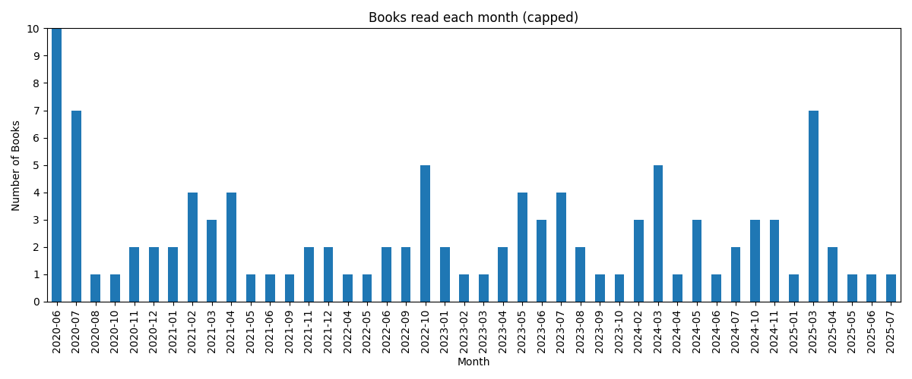
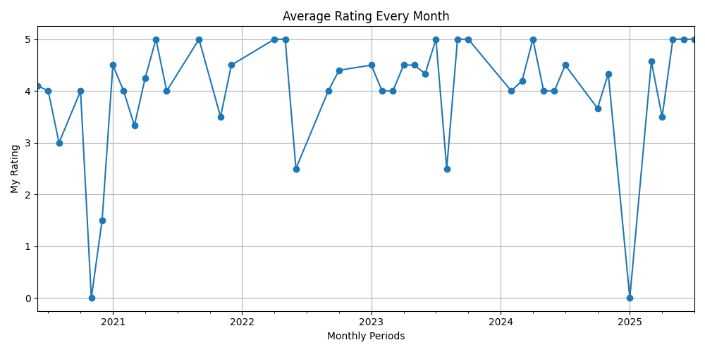
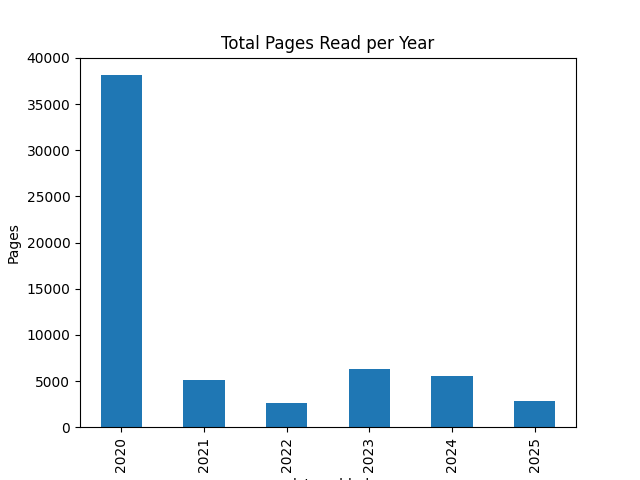
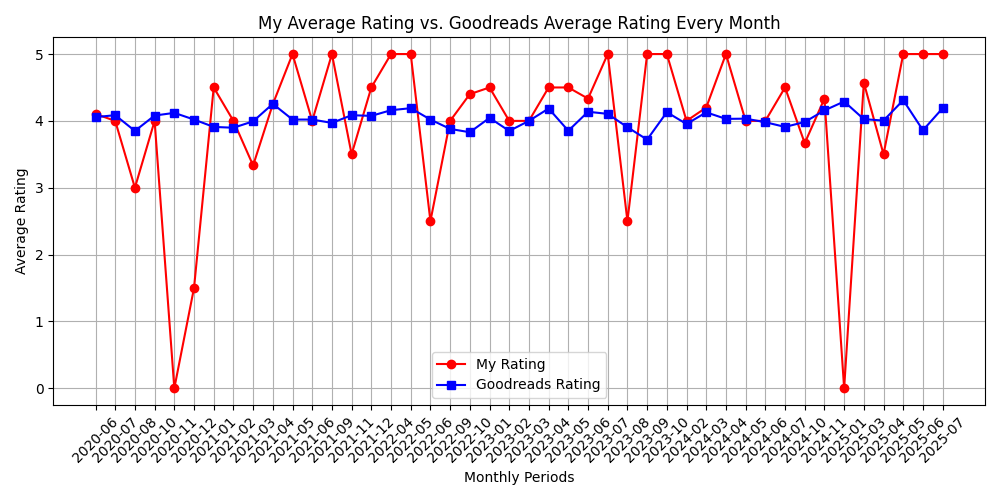
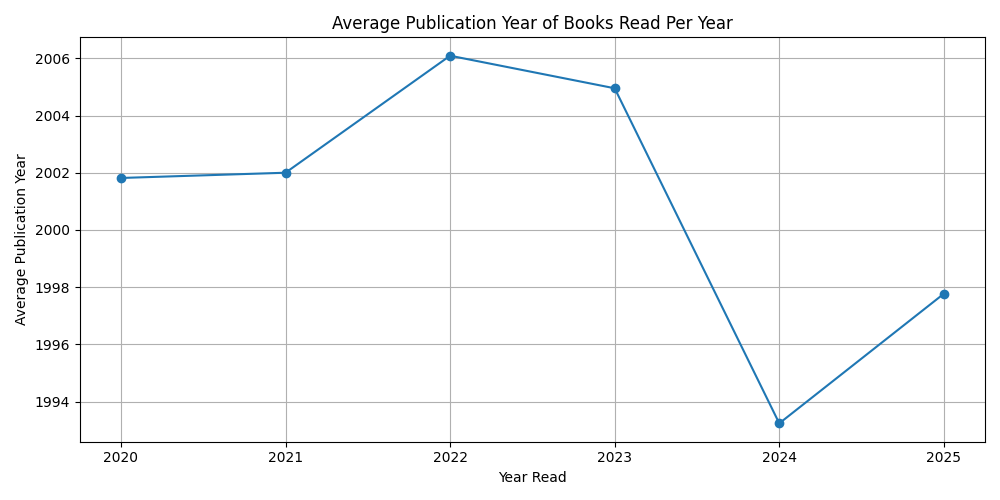

# 📚 Goodreads Book Analysis

This is a simple project exploring my Goodreads library where I've saved information about the books I've read since 2020 to present day.
This project analyzes my personal book reading data, including the dates I've finished the books, my ratings, the site's average ratings, and pages read over time. The goal is to explore my reading habits, compare my ratings, and quantify reading volume. This is a way for me to visualize any trends in my reading and possibly help me in choosing my future reads.

## Project Overview
This project examines a dataset of books I’ve read, focusing on:
- Trends in my personal ratings on a monthly period.
- Comparison of my average ratings to Goodreads' average ratings collected from every other readers.
- Total pages read per year.
- Average publishing time of the books I've read each year.

The analysis is implemented in multiple Python scripts that I will break down below.

First, prepping my dataset.

## Dataset
- Source: Goodreads export `.csv` (file name "goodreads_library_export.csv")
- Size: 516 rows, 24 columns
- Example snippet:

<p style="overflow-x:auto;">

<table>
  <thead>
    <tr>
      <th>Book Id</th>
      <th>Title</th>
      <th>Author</th>
      <th>Author l-f</th>
      <th>Additional Authors</th>
      <th>ISBN</th>
      <th>ISBN13</th>
      <th>My Rating</th>
      <th>Average Rating</th>
      <th>Publisher</th>
      <th>Binding</th>
      <th>Number of Pages</th>
      <th>Year Published</th>
      <th>Original Publication Year</th>
      <th>Date Read</th>
      <th>Date Added</th>
      <th>Bookshelves</th>
      <th>Bookshelves with positions</th>
      <th>Exclusive Shelf</th>
      <th>My Review</th>
      <th>Spoiler</th>
      <th>Private Notes</th>
      <th>Read Count</th>
      <th>Owned Copies</th>
    </tr>
  </thead>
  <tbody>
    <tr>
      <td>17899948</td>
      <td>Rebecca</td>
      <td>Daphne du Maurier</td>
      <td>Maurier, Daphne du</td>
      <td></td>
      <td>0316323705</td>
      <td>9780316323703</td>
      <td>5</td>
      <td>4.25</td>
      <td>Little, Brown and Company</td>
      <td>Kindle Edition</td>
      <td>449</td>
      <td>2013</td>
      <td>1938</td>
      <td></td>
      <td>6/20/2020</td>
      <td></td>
      <td></td>
      <td>read</td>
      <td></td>
      <td></td>
      <td></td>
      <td>1</td>
      <td>0</td>
    </tr>
    <tr>
      <td>34606688</td>
      <td>Tales of Norse Mythology</td>
      <td>Hélène A. Guerber</td>
      <td>Guerber, Hélène A.</td>
      <td></td>
      <td>1435164989</td>
      <td>9781435164987</td>
      <td>0</td>
      <td>3.91</td>
      <td>Barnes & Noble</td>
      <td>Leather Bound</td>
      <td>464</td>
      <td>2017</td>
      <td>1895</td>
      <td></td>
      <td>7/3/2025</td>
      <td>to-read</td>
      <td>to-read (#320)</td>
      <td>to-read</td>
      <td></td>
      <td></td>
      <td></td>
      <td>0</td>
      <td>0</td>
    </tr>
  </tbody>
</table>

</p>

## Data Cleaning & Transformation
Brief explanation of what was cleaned:
- Removed unnecessary columns
- Renamed columns (`'Date Read'` → `date_read`)
- Converted strings to datetime format
- Removed empty rows

### Code
<details>
<summary><strong>📄 View cleaning script</strong></summary>

```python
import pandas as pd

# Load data
df = pd.read_csv("data/goodreads_library_export.csv")

# Show initial shape and columns
print("Initial shape:", df.shape)
print("Initial columns:", df.columns)

# Delete unnecessary columns
dropped_cols = [
    'Book Id', 'ISBN', 'ISBN13', 'Publisher', 'Binding',
    'Author l-f', 'My Thoughts', 'Private Notes', 'Spoiler', 
    'Recommended For', 'Recommended By', 'Owned Copies', 
    'Original Publication Year', 'Bookshelves with positions',
    'Cover Image Url'
]
df = df.drop(columns=[col for col in dropped_cols if col in df.columns])

# Clean the column names
df.columns = df.columns.str.strip().str.lower().str.replace(' ', '_')

# Convert date columns to datetime
df['date_read'] = pd.to_datetime(df['date_read'], errors='coerce')
df['date_added'] = pd.to_datetime(df["date_added"], errors='coerce')

# Fill in missing values
df['number_of_pages'] = df['number_of_pages'].fillna(0).astype(int)
df['my_rating'] = df['my_rating'].fillna(0)
df['average_rating'] = df['average_rating'].fillna(0)

# Filter to only "read" books
df = df[df['exclusive_shelf'] == 'read']

# Save cleaned version
df.to_csv('output/cleaned_books.csv', index=False)

print("Cleaned data saved to output/cleaned_books.csv")
print("Final shape:", df.shape)

 ```
</details>

Here is a preview of the new cleaned data,
<p style="overflow-x:auto;">

<table>
  <thead>
    <tr>
      <th>title</th>
      <th>author</th>
      <th>additional_authors</th>
      <th>my_rating</th>
      <th>average_rating</th>
      <th>number_of_pages</th>
      <th>year_published</th>
      <th>date_read</th>
      <th>date_added</th>
      <th>bookshelves</th>
      <th>exclusive_shelf</th>
      <th>my_review</th>
      <th>read_count</th>
    </tr>
  </thead>
  <tbody>
    <tr>
      <td>Rebecca</td>
      <td>Daphne du Maurier</td>
      <td></td>
      <td>5</td>
      <td>4.25</td>
      <td>449</td>
      <td>2013</td>
      <td></td>
      <td>6/20/2020</td>
      <td></td>
      <td>read</td>
      <td></td>
      <td>1</td>
    </tr>
    <tr>
      <td>The Razor’s Edge</td>
      <td>W. Somerset Maugham</td>
      <td></td>
      <td>5</td>
      <td>4.19</td>
      <td>314</td>
      <td>2003</td>
      <td></td>
      <td>7/3/2025</td>
      <td></td>
      <td>read</td>
      <td></td>
      <td>1</td>
    </tr>
  </tbody>
</table>

</p>

## Number of Books Read per Month

This is a simple plot showing the nuber of books I've read each month. The year 2020 is a big outlier because that's when I installed Goodreads and I added a large number of books I'd already read.

Brief explanation of how it was done:
- The data_added column (dates when I finished the books) is converted to datetime.
- Groupby function is used to group books on a monthly basis.

### Code
<details>
<summary><strong>📄 View script</strong></summary>

```python
import pandas as pd
import matplotlib.pyplot as plt
import numpy as np

#load data
df = pd.read_csv("output/cleaned_books.csv")

#convert date_added to datatime
df["date_added"] = pd.to_datetime(df["date_added"], errors ='coerce')
monthly = df.groupby(df['date_added'].dt.to_period('M')).size()
print(monthly)


#group monthly
books_monthly = df.groupby(df['date_added'].dt.to_period('M')).size()

print(books_monthly)

books_monthly.plot(kind = 'bar', figsize=(12,5),title = "Books read each month (capped)")
plt.ylim(0,10)
plt.ylabel("Number of Books")
yticks = np.linspace(0,10, num = 11)
plt.yticks(yticks)
plt.xlabel("Month")
plt.tight_layout()
plt.show()
```
</details>

This is the generated plot.



## Average Rating Every Month (My Ratings)
I calculated and visualized your average book rating (my_rating) grouped by each month when the book was added.

Brief overview:
- Converted date_added column to datetime.
- Extracted the month period (.dt.to_period('M')) for grouping.
- Grouped data by month and computed the mean of my ratings.
- Used Pandas .plot() with kind='line' and markers to create a line plot showing rating trends over time.
  
  

## Total Pages Read per Year
I summed the total number of pages read per year and displayed it as a bar chart.

Brief overview:
- Grouped data by year extracted from date_added (.dt.to_period('Y')).
- Calculated the sum of number_of_pages for each year.
- Used Pandas .plot() with kind='bar' to create a bar plot illustrating yearly reading volume.

  


  ## My Average Rating vs. Goodreads Average Rating Every Month
I compared my monthly average ratings to Goodreads’ average ratings over time using a line      plot with two lines.

Brief overview:
- Calculated average ratings per month for both my ratings and Goodreads ratings separately via groupby on month.



## Average Publication Year of Books Read Per Year
I computed and plotted the average publication year of books you read each calendar year.

Brief overview:
- Grouped the data by the calendar year from date_added (.dt.year).
- Calculated the mean of year_published for each reading year.
- Created a line plot with markers using Pandas .plot() to show if I tend to read newer or older books over time.



### Code
<details>
<summary><strong>📄 View script</strong></summary>

```python
import pandas as pd
import matplotlib.pyplot as plt

df = pd.read_csv("output/cleaned_books.csv")

df['date_added'] = pd.to_datetime(df['date_added'], errors='coerce')


# month periods
df['month'] = df['date_added'].dt.to_period('M')

#group every month
avg_rating_halfyear= df.groupby('month')['my_rating'].mean()
avg_goodrds_rating_halfyear = df.groupby('month')['average_rating'].mean()

#plot 1 (my ratings)
fig1 = avg_rating_halfyear.plot(kind='line', marker='o', title="Average Rating Every Month", figsize=(10, 5))
plt.ylabel("My Rating")
plt.xlabel("Monthly Periods")
plt.grid(True)
plt.tight_layout()
plt.show()
plt.close()
#pages read over time plot 2
fig2 = df.groupby(df['date_added'].dt.to_period('Y'))['number_of_pages'].sum().plot(kind='bar')
plt.title("Total Pages Read per Year")
plt.ylabel("Pages")
plt.show()
plt.close()
#compare my ratings to goodreads ratings plot 3
plt.figure(figsize=(10, 5))
plt.plot(avg_rating_halfyear.index.astype(str), avg_rating_halfyear, marker='o', label='My Rating', color="red")
plt.plot(avg_goodrds_rating_halfyear.index.astype(str), avg_goodrds_rating_halfyear, marker='s', label='Goodreads Rating', color='blue')
plt.title("My Average Rating vs. Goodreads Average Rating Every Month")
plt.ylabel("Average Rating")
plt.xlabel("Monthly Periods")
plt.grid(True)
plt.legend()
plt.xticks(rotation=45)
plt.tight_layout()
plt.show()
plt.close()

#plot 4 average published year of books ive read each year

avg_pub_year= df.groupby(df['date_added'].dt.year)['year_published'].mean()
plt.figure(figsize=(10,5))
avg_pub_year.plot(kind='line', marker='o', title="Average Publication Year of Books Read Per Year")
plt.ylabel("Average Publication Year")
plt.xlabel("Year Read")
plt.grid(True)
plt.tight_layout()
plt.show()
plt.close()


print("Average Publication Year per Year Read:\n", avg_pub_year)
```
</details>

## Possible Improvements
- Add genre-based statistics
- Add monthly reading goals tracking
- Add sentiment analysis from reviews

I really would have liked to to get a better insight on the genres of the books that I read but unfortunfately the Goodreads database does not include genres and I couldn't add all of them manually.
